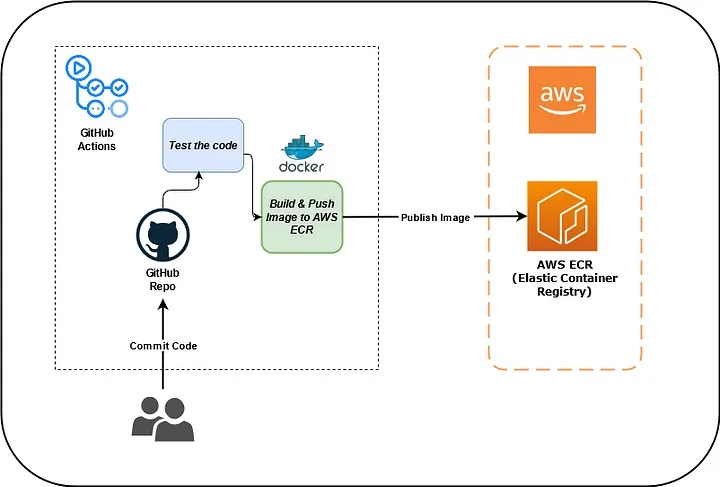

# aws-docker-github-kubernetes-demo
Demo of docker and kubernetes using GitHub Actions utilising AWS

## Prerequisites and dependencies

* AWS Kubernetes deploys into existing VPC / public subnet. 
If you don't have your VPC / subnet yet, you will need to set this up.
* The VPC / subnet should be properly linked with Internet Gateway (IGW) and should have DNS and DHCP enabled.
* Hosted DNS zone configured in Route53 (in case the zone is private you have to use IP address to copy `kubeconfig` and access the cluster).
