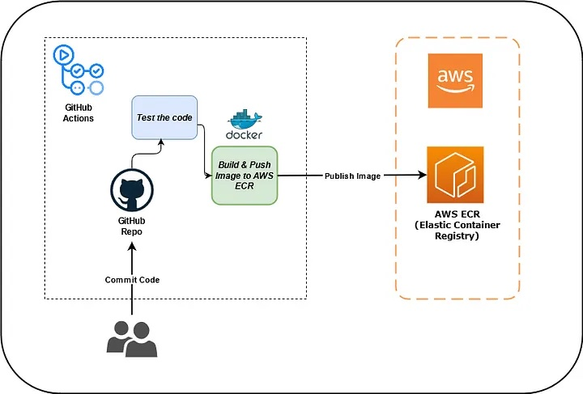

# aws-docker-github-kubernetes-demo

A demo project that builds a small Node.js website, containerises it with Docker, and ships it to **AWS** using **GitHub Actions** for CI/CD. The image is published to **Amazon ECR** and deployed to a Kubernetes cluster running on **Amazon EKS**.



## What's in here

The "Hedgehog" website is a minimal [Express](https://expressjs.com/) app rendered with [Nunjucks](https://mozilla.github.io/nunjucks/) templates. It exposes two routes:

| Route          | Description                                   |
| -------------- | --------------------------------------------- |
| `/`            | Renders the homepage (`<h1>Hedgehog</h1>`)    |
| `/healthcheck` | Returns JSON `{ "uptime": <process uptime> }` |

The pipeline takes that app from source to a running service in EKS:

```
source -> tests (Node 12/14/16/18/20) -> Snyk scan -> docker build -> push to ECR -> deploy to EKS
```

## Repository layout

```
.
├── .github/workflows/
│   ├── cd.yml              # CI/CD: test, security scan, build & push to ECR, deploy to EKS
│   └── security.yml        # Standalone Snyk security scan on every push
├── k8s/
│   ├── namespace.yaml      # kubernetes-github-actions namespace
│   ├── deployment.yaml     # website Deployment (2 replicas, port 3000)
│   ├── service.yaml        # LoadBalancer Service (80 -> 3000)
│   └── kustomization.yaml  # kustomize overlay that injects the ECR image + tag
├── site/                   # the Node.js "Hedgehog" website
│   ├── app.js              # Express app + routes
│   ├── server.js           # HTTP server entrypoint (port 3000)
│   ├── Dockerfile          # multi-stage build on node:20 / node:20-slim
│   ├── package.json        # dependencies + npm scripts (dev/test/start)
│   ├── public/             # static assets (CSS, hedgehog images)
│   ├── views/index.njk     # homepage template
│   └── test/app.test.js    # mocha + supertest integration tests
├── .env.tmpl               # template used to generate the local .env file
├── Makefile                # task runner (thin wrapper over make.sh)
└── make.sh                 # bash automation for setup, dev, and EKS lifecycle
```

## Prerequisites

* **AWS account** with permissions to create IAM users, ECR repositories, and EKS clusters.
* **AWS CLI** configured with a `default` profile (`aws configure`).
* **Node.js** (any of v12–v20) and **npm** for local development.
* **Docker** for building and running the image.
* `eksctl`, `kubectl`, and `yq` — the `make setup` target installs these if missing.
* An existing **VPC / public subnet** for the EKS cluster. It must be linked to an Internet Gateway (IGW) with DNS and DHCP enabled.

## Quick start (local)

```bash
# install Node dependencies
cd site && npm install && cd ..

# run the app locally with hot reload (http://localhost:3000)
make dev

# run the test suite
make test
```

Run the production container locally:

```bash
make build   # build the Docker image
make run     # run it on localhost:3000
make rm      # stop and remove the container
```

## Available commands

All commands are run from the repository root via `make <target>` (or directly with `./make.sh <target>`). Run `make help` to list them.

| Command                     | Description                                                  |
| --------------------------- | ------------------------------------------------------------ |
| `make setup`                | Install `eksctl` + `kubectl` + `yq`, create the AWS IAM user and ECR repository, and generate `.env` |
| `make dev`                  | Local development with hot reload (`nodemon`)                |
| `make test`                 | Run the mocha test suite                                     |
| `make build`                | Build the production Docker image                            |
| `make run`                  | Run the built image on `localhost:3000`                      |
| `make rm`                   | Remove the running container                                 |
| `make cluster-create`       | Create the EKS cluster                                       |
| `make cluster-create-config`| Generate the `kubectl` EKS configuration                     |
| `make cluster-apply-config` | Apply the `kubectl` EKS configuration                        |
| `make cluster-elb`          | Print the cluster's ELB (LoadBalancer) URL                   |
| `make cluster-delete`       | Delete the EKS cluster                                       |

## CI/CD pipeline (`.github/workflows/cd.yml`)

Triggered on push and pull requests against `main`:

1. **run-tests** — runs the test suite across a Node.js version matrix (12, 14, 16, 18, 20).
2. **run-security-tests** — runs a [Snyk](https://snyk.io/) code scan.
3. **build** (on `main` only) — configures AWS credentials, logs in to ECR, then builds and pushes the image tagged `latest` and with the short commit SHA.
4. **deploy** — installs `kubectl`, points it at the EKS cluster, and applies the Kubernetes manifests.

### Required GitHub secrets

| Secret                  | Used for                          |
| ----------------------- | --------------------------------- |
| `AWS_ACCESS_KEY_ID`     | Authenticating to AWS (ECR, EKS)  |
| `AWS_SECRET_ACCESS_KEY` | Authenticating to AWS (ECR, EKS)  |
| `SNYK_TOKEN`            | Running Snyk security scans       |

## Kubernetes deployment

The manifests in `k8s/` deploy the website into the `kubernetes-github-actions` namespace:

* **Deployment** — 2 replicas of the `website` container listening on port `3000`.
* **Service** — a `LoadBalancer` exposing port `80` and forwarding to container port `3000`.
* **kustomization.yaml** — replaces the placeholder image with the ECR repository (`${ECR_REPOSITORY}`) and tag (`${IMAGE_TAG}`).

Once deployed, get the public URL with:

```bash
make cluster-elb
```

## Cleaning up

Tear down the cluster to avoid ongoing AWS charges:

```bash
make cluster-delete
```
